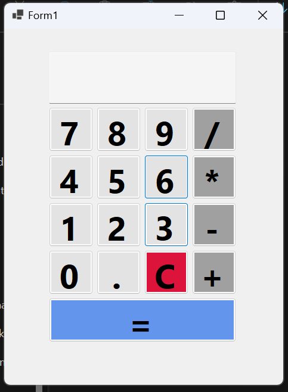

# VB.NET Calculator 🖩

This is a **simple calculator application** built using **VB.NET (Windows Forms App)**.  
It works just like a mobile calculator where numbers are entered using **buttons**, not the keyboard.

## Features
- Addition (+)
- Subtraction (-)
- Multiplication (×)
- Division (÷)
- Clear (C)
- Decimal point (.)
- ReadOnly display textbox (user cannot type manually)

## Technology Used
- **Language**: VB.NET  
- **Framework**: .NET (Windows Forms)  
- **IDE**: Visual Studio  

## How to Run
1. Clone or download this repository.  
2. Open the `.sln` file in **Visual Studio**.  
3. Press **F5** to build and run the calculator.

## Screenshot
Here is how the calculator looks:  

